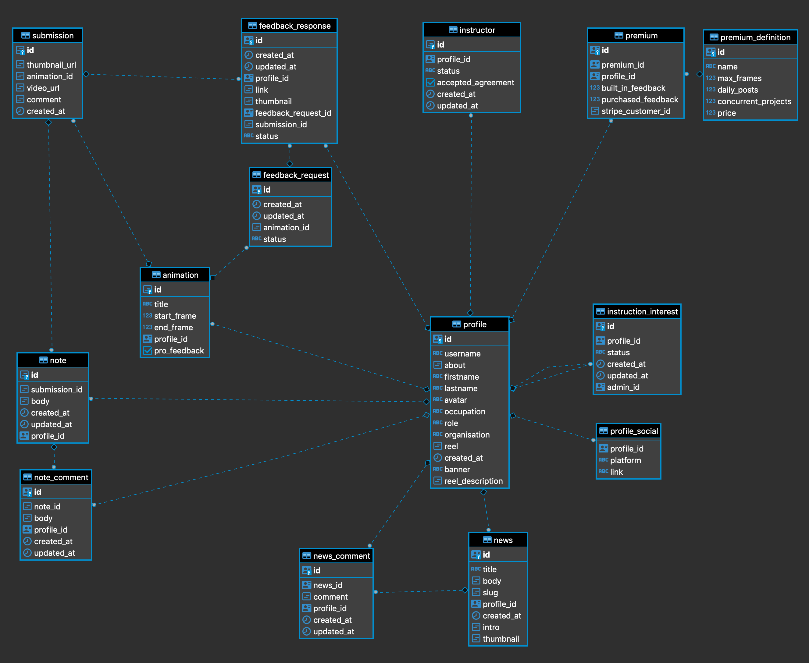

# Database Model

- [Datamodel](#Datamodel) - All our tables and how they relate
- [Sqitch Migration Convention](#Sqitch-Migration-Convention)
- [PgSQL Functions](#pgsql-functions)

In this readme I'll briefly go over how we model our data within PostgresQL, as well as the naming convention for our database migration, and since we use PgSQL functions fairly extensively, I'll cover some of the business logic in there as well.

### Datamodel

_Screenshot of diagram of our framethrower_public schema using [dbeaver](https://dbeaver.com/)_

### Sqitch Migration Convention

### PgSQL Functions
